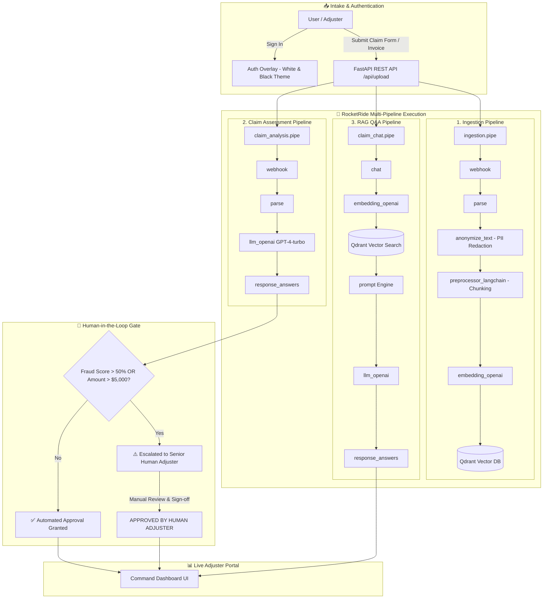

# 🛡️ ClaimPilot — Enterprise AI Insurance Claims & Fraud Assessment Platform

> **Powered by RocketRide AI Framework**  
> An enterprise-grade, load-bearing AI application for insurance carriers, field claim adjusters, and fraud investigation units (SIU). ClaimPilot automates multi-modal claim document processing, PII redaction, damage estimation, fraud risk scoring, RAG-backed policy assistant queries, and human-in-the-loop oversight workflows.

---

## 📸 Key Features & Capabilities

- **🔐 Professional High-Contrast Auth System**: Role-based access control for Senior Adjusters, Commercial Underwriters, and SIU Fraud Auditors.
- **📄 Multi-Pipeline Document Ingestion (`ingestion.pipe`)**: Automatically ingests claim forms, plumber invoices, and property loss reports. Strips PII (Personally Identifiable Information) before embedding and indexing into the **Qdrant** vector database.
- **🧠 Automated Damage & Fraud Assessment (`claim_analysis.pipe`)**: Powered by **GPT-4-turbo**, evaluating claim descriptions, line items, structural damage, and scoring fraud risk (0–100%).
- **💬 RAG Policy & Claim Assistant (`claim_chat.pipe`)**: Conversational Q&A interface allowing adjusters to query policy endorsements, deductibles, and claim evidence with verifiable document citations.
- **🚦 Human-in-the-Loop Oversight Gate**: High-value claims (>$5,000) or high fraud risk flags (score >50%) are automatically escalated to senior licensed human adjusters for sign-off.
- **⚡ Real-Time FastAPI & Command Dashboard**: Live metrics, claim submission modal, document library, interactive chat assistant, and instant manual override buttons.

---

## 🏗️ System Architecture



---

## 📁 Repository Structure

```text
ClaimPilot/
├── app.py                  # FastAPI web server, REST endpoints & browser launcher
├── main.py                 # CLI demonstration runner & RocketRide Client test script
├── check.py                # Diagnostic tool for .env and .pipe schema verification
├── run_gui.py              # Cross-platform Python GUI launcher script
├── run_gui.bat             # Windows one-click execution batch script
├── ingestion.pipe          # RocketRide DAG: Webhook -> Parse -> Anonymize -> Chunk -> Embed -> Qdrant
├── claim_analysis.pipe     # RocketRide DAG: Webhook -> Parse -> GPT-4 Damage/Fraud Assessment
├── claim_chat.pipe         # RocketRide DAG: Chat -> Embed -> Qdrant Search -> Prompt -> GPT-4 Response
├── static/
│   └── index.html          # Enterprise Dashboard UI with White/Black Auth & Live Operations
├── .env                    # Environment variables configuration (RocketRide & OpenAI credentials)
├── env.example             # Example configuration template
├── requirements.txt        # Python package dependencies
└── README.md               # System documentation & quickstart guide
```

---

## ⚙️ Prerequisites & Setup

### 1. Requirements
- **Python 3.10+**
- **RocketRide API Key & Endpoint URI**
- **OpenAI API Key** (for embeddings and LLM reasoning)

### 2. Installation
Clone the repository and install dependencies in a virtual environment:

```bash
# Clone repository
git clone https://github.com/tarunagnihotri534/ClaimPilot.git
cd ClaimPilot

# Create and activate virtual environment
python -m venv .venv

# Windows (PowerShell):
.\.venv\Scripts\activate

# Linux / macOS:
source .venv/bin/activate

# Install requirements
pip install -r requirements.txt
```

### 3. Environment Configuration
Create a `.env` file in the project root directory (or copy from `env.example`):

```ini
ROCKETRIDE_URI=https://api.rocketride.ai
ROCKETRIDE_APIKEY=your_rocketride_api_key_here
ROCKETRIDE_OPENAI_KEY=sk-proj-your_openai_api_key_here
ROCKETRIDE_QDRANT_HOST=localhost
ROCKETRIDE_COLLECTION_NAME=claimpilot_evidence
```

---

## 🚀 How to Run ClaimPilot

### Method A: Launcher Script (Recommended)
Runs the server and automatically opens the Command Portal in your default web browser:
```bash
python run_gui.py
```

### Method B: Windows Batch Script
```cmd
.\run_gui.bat
```

### Method C: Uvicorn Dev Server
```bash
python -m uvicorn app:app --reload --port 8000
```
Open **`http://127.0.0.1:8000`** in your browser.

### Method D: CLI Diagnostics & Headless Pipeline Test
Run full schema and environment validation:
```bash
python check.py
```
Run CLI end-to-end simulation:
```bash
python main.py
```

---

## 📡 API Reference

| Endpoint | Method | Description |
| :--- | :--- | :--- |
| `GET /` | `GET` | Serves the main ClaimPilot Web Dashboard UI. |
| `POST /api/login` | `POST` | Authenticates adjuster session and issues bearer token. |
| `GET /api/stats` | `GET` | Returns high-level metrics (total claims, payouts, escalation rate). |
| `GET /api/claims` | `GET` | Lists active claims and their human oversight gate status. |
| `POST /api/claims` | `POST` | Submits new claim form for automated AI analysis & risk scoring. |
| `POST /api/claims/{id}/approve` | `POST` | Executes manual human adjuster override sign-off. |
| `POST /api/upload` | `POST` | Ingests claim documents (`ingestion.pipe`), redacting PII to vector storage. |
| `POST /api/chat` | `POST` | Sends queries to the RAG Policy & Claim Assistant (`claim_chat.pipe`). |

---

## 🛡️ Security, Privacy & Resource Safety

1. **Automatic PII Redaction**: Documents passing through `ingestion.pipe` execute `anonymize_text` before vector store insertion, protecting policyholder SSNs, phone numbers, and addresses.
2. **Clean Lifecycle Cleanup**: `app.py` and `main.py` explicitly execute `client.terminate(token)` upon shutdown, preventing orphan pipeline processes on the RocketRide server.
3. **Environment Safety**: Sensitive API keys (`ROCKETRIDE_APIKEY`, `ROCKETRIDE_OPENAI_KEY`) are dynamically injected via environment variable expansion and never committed to source control.

---

## 🤝 Contributing & License

Designed and developed for high-availability insurance enterprise operations.  
For technical support or pipeline extensions, refer to the official [RocketRide Documentation](https://rocketride.ai).
