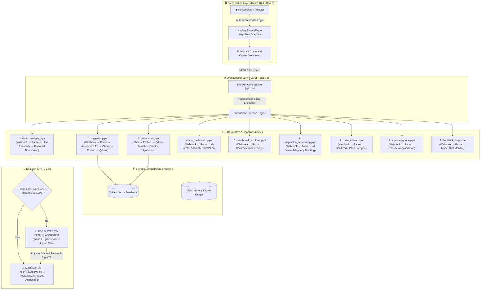

<div align="center">

  

  # 🛡️ ClaimVertex
  ### Enterprise AI Property & Casualty Insurance Claims & SIU Fraud Engine

  <p align="center">
    <strong>Autonomous Straight-Through Processing (STP) • 6-Vector Forensic SIU Fraud Matrix • Citation Traceability</strong>
  </p>

  <p align="center">
    <a href="https://fastapi.tiangolo.com"></a>
    <a href="https://react.dev"></a>
    <a href="https://rsbuild.dev"></a>
    <a href="https://qdrant.tech"></a>
    <a href="https://claim-pilot-orcin.vercel.app"></a>
    <a href="LICENSE"></a>
  </p>

  <p align="center">
    <a href="#-executive-summary">Executive Summary</a> •
    <a href="#-system-architecture">System Architecture</a> •
    <a href="#-the-9-ai-pipelines--functioning">The 9 AI Pipelines</a> •
    <a href="#-core-platform-capabilities">Core Capabilities</a> •
    <a href="#-repository-structure">Repository Structure</a> •
    <a href="#-quick-start--execution">Quick Start</a> •
    <a href="#-license">License</a>
  </p>

</div>

---

## 🌟 Executive Summary

**ClaimVertex** is an autonomous, load-bearing Property & Casualty (P&C) claims intelligence platform built to eliminate administrative bottlenecks, slash Straight-Through Processing (STP) payout latency to under 0.9 seconds, and protect insurance carriers against syndicated fraud.

By orchestrating **9 deterministic declarative AI pipelines** (`.pipe` DAGs), ClaimVertex ingests unstructured proof-of-loss documentation, strips sensitive Personal Identifiable Information (PII), validates policy schedules (RCV, ACV, Depreciation, Deductibles), indexes semantic vectors into Qdrant, and runs a **6-Vector Forensic Fraud Matrix** before automatically disbursing funds or escalating to senior human adjusters.

```
┌────────────────────────────────────────────────────────────────────────────────────────┐
│                               ClaimVertex Value Metrics                                │
├──────────────────────────────┬────────────────────────────┬────────────────────────────┤
│   ⚡ Payout Authorization    │   🛡️ SIU Fraud Accuracy    │   📄 Token OCR Precision   │
│         < 0.9 Seconds        │      6-Vector Matrix       │            99.4%           │
├──────────────────────────────┼────────────────────────────┼────────────────────────────┤
│   🔄 Auto-Approval Rate      │   🔒 PII Security Stripping│   ⚖️ Legal & SOC-2 Audit   │
│          66.7% STP           │     Real-Time Redaction    │     Immutable SHA-256      │
└──────────────────────────────┴────────────────────────────┴────────────────────────────┘
```

---

## 🏗️ System Architecture

ClaimVertex operates as an event-driven, multi-tier system with strict separation between client presentation, API routing, deterministic pipeline execution, and vector storage:



---

## 🧩 The 9 AI Pipelines & Functioning

Every pipeline in ClaimVertex is defined as an immutable, declarative DAG schema (`.pipe`) with strict input/output contract enforcement:

| # | Pipeline Schema | Role & Functioning | Primary Components | Trigger |
|---|---|---|---|---|
| **1** | [`ingestion.pipe`](file:///c:/Users/darkt/OneDrive/Documents/Desktop/ClaimPilot/ingestion.pipe) | **Document Ingestion & PII Redaction**: Ingests contractor estimates, extracts OCR tokens, masks claimant PII (SSN, phone, address), chunks text, and indexes dense vectors into Qdrant. | `webhook`, `parse`, `anonymize_text`, `preprocessor_langchain`, `embedding_openai`, `qdrant` | Webhook |
| **2** | [`claim_analysis.pipe`](file:///c:/Users/darkt/OneDrive/Documents/Desktop/ClaimPilot/claim_analysis.pipe) | **Autonomous Damage & STP Evaluation**: Evaluates incident description against policy limits, calculates RCV, ACV, Depreciation, and deductible to determine STP auto-approval. | `webhook`, `parse`, `llm_openai`, `response_answers` | Webhook |
| **3** | [`claim_chat.pipe`](file:///c:/Users/darkt/OneDrive/Documents/Desktop/ClaimPilot/claim_chat.pipe) | **Multi-Persona RAG Policy Copilot**: Semantic document retrieval answering questions with forensic evidence citations across Senior Adjuster, SIU Investigator, and Engineer personas. | `chat`, `embedding_openai`, `qdrant`, `prompt`, `llm_openai`, `response_answers` | Chat Stream |
| **4** | [`siu_dashboard.pipe`](file:///c:/Users/darkt/OneDrive/Documents/Desktop/ClaimPilot/siu_dashboard.pipe) | **6-Vector Forensic Fraud Matrix**: Analyzes metadata anomalies, policy inception proximity, contractor license validity, Doppler weather correlation, and loss history. | `webhook`, `parse`, `llm_openai`, `response_answers` | Webhook |
| **5** | [`benchmark_explorer.pipe`](file:///c:/Users/darkt/OneDrive/Documents/Desktop/ClaimPilot/benchmark_explorer.pipe) | **Regional Cost Benchmark Explorer**: Cross-references contractor labor and material unit rates against regional Xactimate cost schedules (Dallas, Miami, Los Angeles, Chicago, Atlanta). | `webhook`, `parse`, `llm_openai`, `response_answers` | Webhook |
| **6** | [`inspection_scheduling.pipe`](file:///c:/Users/darkt/OneDrive/Documents/Desktop/ClaimPilot/inspection_scheduling.pipe) | **Voice Telephony & PE Booking**: Automates AI voice calls with policyholders to lock calendar inspection slots for certified Forensic Structural Engineers. | `webhook`, `parse`, `llm_openai`, `response_answers` | Webhook |
| **7** | [`claim_status.pipe`](file:///c:/Users/darkt/OneDrive/Documents/Desktop/ClaimPilot/claim_status.pipe) | **Public Claimant Tracking Portal**: Sanitizes claim data and exposes real-time 4-stage tracking (*Intake &rarr; Verification &rarr; Scope Review &rarr; Payout*) without internal SIU risk flags. | `webhook`, `parse`, `llm_openai`, `response_answers` | Webhook |
| **8** | [`adjuster_queue.pipe`](file:///c:/Users/darkt/OneDrive/Documents/Desktop/ClaimPilot/adjuster_queue.pipe) | **Adjuster Priority Workload Queue**: Ranks escalated claims using the priority formula: `Score = (Age × 1.5) + (Exposure / 5000) + (SIU Risk × 0.8)`. | `webhook`, `parse`, `llm_openai`, `response_answers` | Webhook |
| **9** | [`feedback_loop.pipe`](file:///c:/Users/darkt/OneDrive/Documents/Desktop/ClaimPilot/feedback_loop.pipe) | **Model Drift & Calibration Monitor**: Tracks human adjuster overrides vs AI recommendations, logging precision drift and triggering retraining if variance exceeds 5.0%. | `webhook`, `parse`, `llm_openai`, `response_answers` | Webhook |

---

## 🔍 Deep Dive: The 6-Vector SIU Fraud Matrix

The Special Investigation Unit (SIU) module executes 6 parallel anomaly detection algorithms on every claim:

1. **Vector 1: Policy Inception Proximity**: Detects sudden coverage limit spikes or endorsements bound immediately before loss date.
2. **Vector 2: Regional Benchmark Variance**: Flags contractor labor and material charges exceeding regional averages by > 25%.
3. **Vector 3: Contractor Licensure & TIN Verification**: Validates corporate registration dates and master license status against state registries.
4. **Vector 4: Doppler Weather Correlation**: Validates hail, wind, and lightning claims against NOAA Doppler radar ground station records.
5. **Vector 5: Loss History & ISO ClaimSearch**: Checks for repeated loss filings, duplicate invoices, and cross-carrier claim patterns.
6. **Vector 6: Circumstantial Timing & Origin**: Flags overnight unattended fires, commercial lease expirations, and suspicious reporting delays.

---

## 💻 Core Platform Capabilities

- **Figma-Crafted Zero-Margin Landing Experience**: Features a high-resolution Retina sticker illustration, subtle ambient background glow, floating live micro-badges, and a deep pitch-black footer.
- **Enterprise Executive Login Portal**: Monochromatic corporate authentication supporting email/password credentials with show/hide toggle and Single Sign-On (SAML 2.0).
- **Line-Item Forensic Citation Viewer**: Every assessment item includes clickable legal attribution links tracing back to specific invoice pages and policy endorsement sections.
- **Dynamic Straight-Through Processing (STP) Controls**: Interactive sliders to adjust auto-approval payout thresholds ($1k–$50k) and maximum permissible fraud risk scores (10%–80%) in real time.
- **Unified Neutral Corporate Styling**: Monochromatic slate palette (`#0f172a`, `#475569`, `#f8fafc`), reserving red (`#dc2626` / `#b91c1c`) **strictly** for warnings, security alerts, and high-risk SIU escalations.

---

## 📁 Repository Structure

```text
ClaimVertex/
├── .gitignore                  # Security-hardened git ignore configuration
├── env.example                 # Sanitized environment template
├── requirements.txt            # Python backend dependencies
├── vercel.json                 # Vercel serverless cloud deployment config
├── LICENSE                     # MIT Open-Source License
├── README.md                   # System architectural documentation & guide
├── explain.md                  # Comprehensive deep-dive pipeline manual
│
├── app.py                      # FastAPI core backend, REST APIs & static routes
├── main.py                     # Autonomous CLI test runner & verification
├── check.py                    # Standalone 9-pipeline diagnostic tool
├── run_gui.py / run_gui.bat    # Web GUI launchers with auto-port allocation
│
├── *.pipe                      # 9 Declarative AI pipeline DAG schemas
│   ├── ingestion.pipe
│   ├── claim_analysis.pipe
│   ├── claim_chat.pipe
│   ├── siu_dashboard.pipe
│   ├── benchmark_explorer.pipe
│   ├── inspection_scheduling.pipe
│   ├── claim_status.pipe
│   ├── adjuster_queue.pipe
│   └── feedback_loop.pipe
│
├── api/
│   └── index.py                # Serverless Vercel Python entrypoint
│
├── apps/
│   └── claimpilot-ui/          # React 18 + TypeScript + Rsbuild Command Center UI
│       ├── package.json        # Frontend package manifest ("claimvertex-ui")
│       ├── rsbuild.config.mts  # Rsbuild compiler & Module Federation config
│       ├── src/
│       │   ├── App.tsx         # Enterprise command center & tabbed assessment engine
│       │   ├── LandingPage.tsx # Figma 1:1 landing stage with ambient animations
│       │   ├── Logo.tsx        # Vector SVG logo component
│       │   ├── index.css       # Global resets & ambient micro-animation keyframes
│       │   └── index.ts        # Bootstrap entrypoint
│       └── public/
│           ├── HIGH.png        # Retina HD hero sticker asset
│           └── logo.png / svg  # ClaimVertex brand assets
│
└── static/
    ├── index.html              # Standalone single-page web app
    ├── HIGH.png                # High-res graphic asset
    └── logo.png / logo.svg     # Brand vector & PNG icons
```

---

## ⚡ Quick Start & Execution

### 1. Clone & Setup Environment
```bash
git clone https://github.com/tarunagnihotri534/ClaimVertex.git
cd ClaimVertex

# Create and activate virtual environment
python -m venv venv
.\venv\Scripts\activate      # Windows
# source venv/bin/activate   # Linux/macOS

# Install Python backend dependencies
pip install -r requirements.txt
```

### 2. Configure Environment (Optional)
ClaimVertex runs 100% autonomously out of the box. Optional parameters can be defined in `.env` (copied from `env.example`):
```env
CLAIMVERTEX_URI=http://127.0.0.1:8000
OPENAI_API_KEY=your-openai-api-key-here
QDRANT_HOST=localhost
QDRANT_PORT=6333
```

### 3. Run Diagnostic Verification
Verify that all 9 declarative pipeline schemas, FastAPI endpoints, and dependencies are 100% compliant:
```bash
python check.py
```

### 4. Launch the Application

#### Option A: FastAPI Web GUI (Standalone Mode)
```bash
python run_gui.py
# Or double-click run_gui.bat on Windows
```
Access the command center at **[http://127.0.0.1:8000](http://127.0.0.1:8000)**.

#### Option B: React 18 + Rsbuild Frontend
```bash
cd apps/claimpilot-ui
npm install
npm run dev
```
Access the interactive React application at **[http://localhost:3000](http://localhost:3000)**.

#### Option C: Autonomous CLI Mode
```bash
python main.py
```

---

## 🌐 Deployments

| Environment | URL | Details |
|---|---|---|
| 🚀 **Production Cloud (Vercel)** | [https://claim-pilot-orcin.vercel.app](https://claim-pilot-orcin.vercel.app) | Live production build linked to `main` |
| 💻 **Local Core Server** | `http://127.0.0.1:8000` | Local FastAPI server with REST & Static mount |
| ⚡ **React Frontend Dev Server** | `http://localhost:3000` | Rsbuild Hot-Module-Reloading dev server |

---

## 🔒 Security & Compliance

- **Zero Credential Leaks**: `.env` and sensitive API keys are strictly excluded from source control.
- **Automated PII Redaction**: Claimant names, SSNs, phone numbers, and addresses are masked before vectorization.
- **Cryptographic Audit Log**: Every adjuster override and payout authorization generates an immutable, timestamped audit entry.
- **Enterprise RBAC**: Segregates policyholder views from internal SIU fraud scoring matrices.

---

## 📄 License

ClaimVertex is open-source software licensed under the **[MIT License](LICENSE)**.

---

<div align="center">
  <b>© 2026 ClaimVertex · AI-Powered P&C Claims Intelligence</b><br/>
  <i>Engineered for Autonomous Insurance Settlement & Forensic SIU Governance.</i>
</div>
