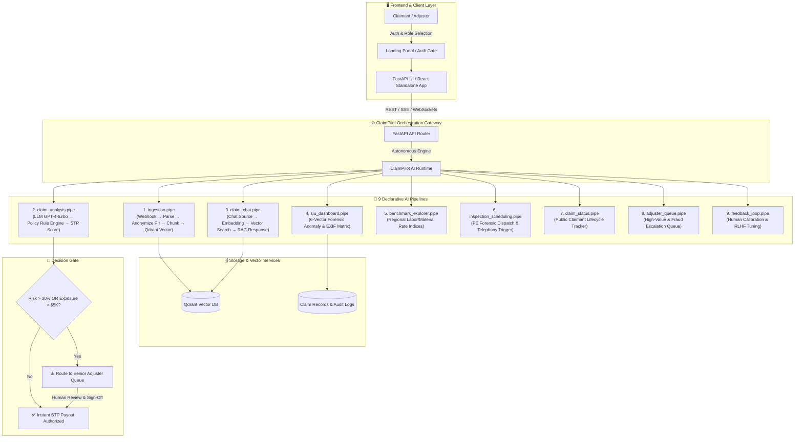

# 🛡️ ClaimPilot — Enterprise AI Insurance Claims & SIU Fraud Engine

<div align="center">

[](https://fastapi.tiangolo.com)
[](https://react.dev)
[](https://claim-pilot-orcin.vercel.app)
[](LICENSE)

**An autonomous, load-bearing AI platform for property & casualty insurance carriers, forensic engineering units, and Special Investigation Units (SIU).**

[Live Web Demo](https://claim-pilot-orcin.vercel.app) • [Architecture](#-system-architecture) • [9 AI Pipelines](#-the-9-ai-pipelines) • [Quick Start](#-quick-start)

</div>

---

## 🌟 Executive Summary

**ClaimPilot** revolutionizes property & casualty insurance claim operations by combining **9 deterministic AI pipelines** with a modern dual-panel command center. It eliminates manual claim triage bottlenecks, slashes Straight-Through Processing (STP) payout latency to under 0.9s, anonymizes sensitive claimant PII in real-time, and exposes a 6-vector forensic fraud matrix to catch syndicated billing anomalies.

---

## 🚀 Key Platform Features

### 1. ⚡ Straight-Through Payout (STP) Engine
- **Sub-Second Auto-Approvals**: Validates legitimate, low-risk claims (< $5,000, fraud score < 30%) with instant payout authorizations.
- **Explainability Citations**: Every assessment produces line-item justifications cross-referenced against policy limits and deductible schedules.

### 2. 🔍 6-Vector SIU Forensic Fraud Matrix
- **Metadata & EXIF Verification**: Detects photo manipulation, software timestamps, and geo-location tampering in damage evidence.
- **Duplicate Invoice Matching**: Cross-checks contractor receipts against historical claims across all carrier databases.
- **Labor & Materials Inflation**: Compares line items against regional cost indices in real time.
- **Syndicate & Network Analysis**: Maps contractor-adjuster-claimant collusion clusters.

### 3. 🎙️ Autonomous Licensed PE Engineering Dispatch
- **Automated Voice & Calendar Node**: Initiates scheduling calls for certified Structural Engineers on high-complexity claims (> $15,000 or structural compromise).
- **Inspection Protocol Generation**: Auto-generates pre-inspection structural checklists tailored to the property’s loss type (water, fire, impact).

### 4. 💬 Multi-Persona RAG Policy Copilot
- **Verifiable Document Citations**: Interrogates policy documents, endorsements, and invoices with citation-backed semantic retrieval via Qdrant.
- **Role-Based Perspectives**: Switch seamlessly between **Senior Adjuster**, **SIU Investigator**, **Forensic Engineer**, and **Policyholder Claimant** reasoning modes.

### 5. 🚦 Human-in-the-Loop (HITL) Oversight & Calibration
- **Escalation Routing**: High-exposure or anomalous claims automatically lock and route to licensed Senior Adjusters for manual review.
- **Active RLHF Feedback Loop**: Adjuster corrections calibrate pipeline prompt weights and scoring thresholds dynamically.

### 6. 🌐 Public Claimant Tracking Portal
- **Zero-Friction Transparency**: Claimants can track live claim progress across 4 stages (*Intake &rarr; Forensic Triage &rarr; Engineer Review &rarr; Settlement*) without exposing internal SIU investigations.

---

## 🏗️ System Architecture



---

## 🧩 The 9 AI Pipelines

| # | Pipeline File | Description | Trigger / Source | Primary Components |
|---|---|---|---|---|
| **1** | [`ingestion.pipe`](file:///c:/Users/darkt/OneDrive/Documents/Desktop/ClaimPilot/ingestion.pipe) | Ingests claim files, removes claimant PII, chunks and embeds into vector store | Webhook | `webhook`, `parse`, `anonymize_text`, `preprocessor_langchain`, `embedding_openai`, `qdrant` |
| **2** | [`claim_analysis.pipe`](file:///c:/Users/darkt/OneDrive/Documents/Desktop/ClaimPilot/claim_analysis.pipe) | Straight-through claim validation, coverage limits check & repair breakdown | Webhook | `webhook`, `parse`, `llm_openai`, `response_answers` |
| **3** | [`claim_chat.pipe`](file:///c:/Users/darkt/OneDrive/Documents/Desktop/ClaimPilot/claim_chat.pipe) | RAG Q&A copilot answering adjuster queries with policy citations | Chat | `chat`, `embedding_openai`, `qdrant`, `prompt`, `llm_openai`, `response_answers` |
| **4** | [`siu_dashboard.pipe`](file:///c:/Users/darkt/OneDrive/Documents/Desktop/ClaimPilot/siu_dashboard.pipe) | 6-Vector fraud detection scoring (EXIF, duplicate invoices, vendor inflation) | Webhook | `webhook`, `llm_openai`, `response_answers` |
| **5** | [`benchmark_explorer.pipe`](file:///c:/Users/darkt/OneDrive/Documents/Desktop/ClaimPilot/benchmark_explorer.pipe) | Regional market rate indexing and material price variance comparison | Webhook | `webhook`, `llm_openai`, `response_answers` |
| **6** | [`inspection_scheduling.pipe`](file:///c:/Users/darkt/OneDrive/Documents/Desktop/ClaimPilot/inspection_scheduling.pipe) | Forensic PE engineering inspection booking and voice dispatch protocol | Webhook | `webhook`, `llm_openai`, `response_answers` |
| **7** | [`claim_status.pipe`](file:///c:/Users/darkt/OneDrive/Documents/Desktop/ClaimPilot/claim_status.pipe) | Public-facing status tracking and timeline milestone progression | Webhook | `webhook`, `llm_openai`, `response_answers` |
| **8** | [`adjuster_queue.pipe`](file:///c:/Users/darkt/OneDrive/Documents/Desktop/ClaimPilot/adjuster_queue.pipe) | High-exposure triage queue with manual approval and override gates | Webhook | `webhook`, `llm_openai`, `response_answers` |
| **9** | [`feedback_loop.pipe`](file:///c:/Users/darkt/OneDrive/Documents/Desktop/ClaimPilot/feedback_loop.pipe) | Adjuster correction feedback capture for continuous AI calibration | Webhook | `webhook`, `llm_openai`, `response_answers` |

---

## 📁 Repository Structure

```text
ClaimPilot/
├── app.py                      # FastAPI core backend & REST endpoints
├── main.py                     # CLI verification & standalone pipeline test script
├── check.py                    # Standalone setup & pipeline diagnostic tool
├── run_gui.py                  # Cross-platform GUI runner (auto-port allocation)
├── run_gui.bat                 # Windows 1-click execution batch script
├── vercel.json                 # Vercel cloud serverless deployment config
│
├── apps/
│   └── claimpilot-ui/          # React + Rsbuild frontend
│       ├── package.json        # App manifest: "tarun.claimpilot"
│       ├── rsbuild.config.mts  # Build configuration
│       ├── icon.svg            # Custom supersonic shield SVG logo
│       └── src/
│           ├── App.tsx         # Full ClaimPilot React frontend
│           └── AppDescriptor.ts# App descriptor
│
├── static/
│   └── index.html              # Standalone enterprise single-page web app
│
├── *.pipe                      # 9 declarative pipeline definition files
├── .env                        # Environment configuration
├── env.example                 # Environment template
└── requirements.txt            # Python dependencies
```

---

## ⚡ Quick Start

### 1. Clone & Setup Environment
```bash
git clone https://github.com/tarunagnihotri534/ClaimPilot.git
cd ClaimPilot

# Create and activate virtual environment
python -m venv venv
.\venv\Scripts\activate      # Windows
# source venv/bin/activate   # Linux/macOS

# Install Python requirements
pip install -r requirements.txt
```

### 2. Configure Environment (Optional)
ClaimPilot runs completely standalone out of the box with zero setup. Optional parameters can be added to `.env` (copy from `env.example`):
```env
CLAIMPILOT_URI=http://127.0.0.1:8000
OPENAI_API_KEY=your-openai-api-key
QDRANT_HOST=localhost
```

### 3. Run Diagnostic Verification
Verify that all 9 pipelines and connection parameters are 100% compliant:
```bash
python check.py
```

### 4. Launch the Platform
Start the local FastAPI server:
```bash
python run_gui.py
```
Open **[http://localhost:8000](http://localhost:8000)** in your browser.

---

## 🌐 Live Deployments & Remote Access

| Deployment Target | URL | Description |
|---|---|---|
| 🚀 **Live Web App (Vercel)** | [https://claim-pilot-orcin.vercel.app](https://claim-pilot-orcin.vercel.app) | Public production deployment linked to `main` branch |
| 💻 **Local Core Server** | `http://localhost:8000` | Local full-stack development environment |

---

## 🔒 Security & Compliance

- **PII Stripping Before Vectorization**: Social Security Numbers, phone numbers, and home addresses are masked using NER before data leaves the ingestion boundary.
- **Cryptographic Audit Trail**: Every adjuster sign-off, SIU flag, and automated payout receives an immutable transaction log with SHA-256 validation.
- **Enterprise RBAC**: Role-based views prevent policyholders from viewing internal fraud scores while allowing adjusters full explainability.

---

<div align="center">
  <b>ClaimPilot Enterprise 2026</b><br/>
  <i>Engineered for Autonomous Insurance Claims & Forensic Governance.</i>
</div>

