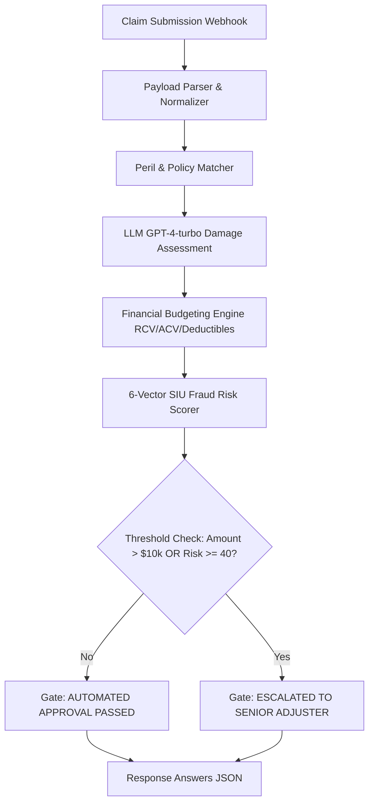
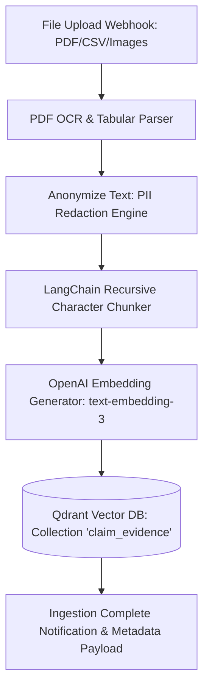
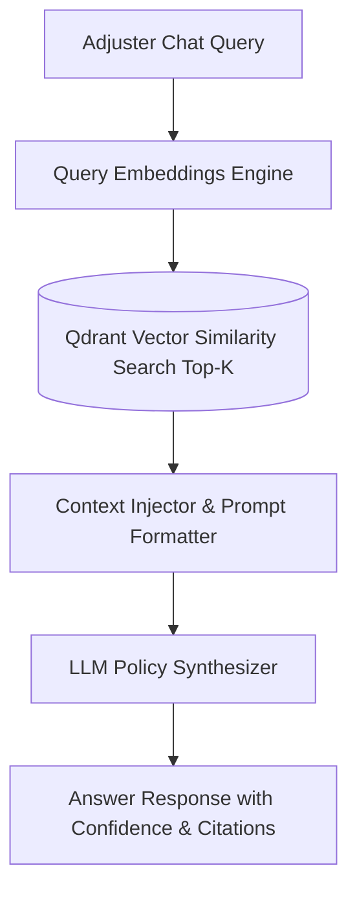

# ClaimPilot Enterprise Architecture & Multi-Pipeline Workflow Guide

An in-depth technical explanation of **ClaimPilot**, its end-to-end architecture, the **Autonomous Pipeline Engine**, and the pipeline-driven workflows for enterprise insurance claims settlement, document intelligence, and Special Investigation Unit (SIU) fraud prevention.

---

## Table of Contents

1. [Executive Overview](#1-executive-overview)
2. [End-to-End System Architecture](#2-end-to-end-system-architecture)
3. [Autonomous AI Core Workflow & Pipeline Engine](#3-autonomous-ai-core-workflow--pipeline-engine)
   - [What is a ClaimPilot Pipeline (.pipe)?](#what-is-a-claimpilot-pipeline-pipe)
   - [The 8 Core Node Components](#the-8-core-node-components)
   - [Pipeline 1: claim_analysis.pipe](#pipeline-1-claim_analysispipe)
   - [Pipeline 2: ingestion.pipe](#pipeline-2-ingestionpipe)
   - [Pipeline 3: claim_chat.pipe](#pipeline-3-claim_chatpipe)
4. [Python Backend & API Integration](#4-python-backend--api-integration)
   - [Lifecycle & Autonomous Standalone Engine](#lifecycle--autonomous-standalone-engine)
   - [Query Execution & RAG Copilot](#query-execution--rag-copilot)
   - [Lane Extraction & Result Parsing](#lane-extraction--result-parsing)
5. [Insurance Financial Accounting & Settlement Mathematics](#5-insurance-financial-accounting--settlement-mathematics)
6. [6-Vector SIU Fraud Risk Matrix](#6-6-vector-siu-fraud-risk-matrix)
7. [Human-in-the-Loop (HITL) Gate & Digital Authorization Protocol](#7-human-in-the-loop-hitl-gate--digital-authorization-protocol)
8. [Frontend & Command Center Integration](#8-frontend--command-center-integration)

---

## 1. Executive Overview

Property & Casualty (P&C) insurance carriers face two major operational challenges:
1. **Settlement Latency**: Manual review of First Notice of Loss (FNOL) takes days or weeks.
2. **Fraud Leakage**: Fraudulent claims cost U.S. insurers over $308 Billion annually.

**ClaimPilot** solves this by embedding an **Autonomous Multi-Pipeline AI Engine** as the core orchestrator. It automates First-Party Property Damage assessments, ingests unstructured proof-of-loss PDFs, performs automated PII redaction, indexes vectors into Qdrant, calculates real-dollar settlement budgets (RCV, ACV, Depreciation, Deductibles), and screens claims through a 6-vector SIU fraud matrix before either issuing a Straight-Through Processing (STP) payout or escalating to senior human adjusters.

---

## 2. End-to-End System Architecture

The ClaimPilot ecosystem is structured as a multi-tier, event-driven platform:

```text
┌──────────────────────────────────────────────────────────────────────────────────┐
│                             USER INTERFACES                                      │
│                                                                                  │
│   Web Dashboard (HTML5 / Vanilla CSS / JS)     React Enterprise App (React / TS) │
│            http://127.0.0.1:8000                          apps/claimpilot-ui/    │
└───────────────────────────┬───────────────────────────────────┬──────────────────┘
                            │ HTTP / REST                       │ React Bridge
                            ▼                                   ▼
┌──────────────────────────────────────────────────────────────────────────────────┐
│                   FASTAPI BACKEND GATEWAY (app.py / api/index.py)                │
│                                                                                  │
│   • POST /api/analyze         • POST /api/upload          • POST /api/chat       │
│   • POST /api/claims/approve  • POST /api/claims/escalate • GET  /api/stats      │
│                                                                                  │
│   ┌──────────────────────────────────────────────────────────────────────────┐   │
│   │                   ClaimPilot Standalone Pipeline Engine                  │   │
│   │   Task Tokens: tokens["analysis"], tokens["ingestion"], tokens["chat"]   │   │
│   └──────────────────────────────────┬───────────────────────────────────────┘   │
└──────────────────────────────────────┼───────────────────────────────────────────┘
                                       │ Native Execution Pipeline
                                       ▼
┌──────────────────────────────────────────────────────────────────────────────────┐
│                    CLAIMPIOT CORE MULTI-PIPELINE ENGINE                          │
│                                                                                  │
│   ┌────────────────────────┐ ┌────────────────────────┐ ┌────────────────────┐   │
│   │   claim_analysis.pipe  │ │     ingestion.pipe     │ │  claim_chat.pipe   │   │
│   │  • Parse & Classify    │ │  • OCR / PDF Parse     │ │  • Query Vectorize │   │
│   │  • GPT-4-turbo Reason  │ │  • PII Anonymizer      │ │  • Qdrant Top-K    │   │
│   │  • 6-Vector SIU Score  │ │  • LangChain Chunker   │ │  • Prompt Context  │   │
│   │  • Financial Settlement│ │  • text-embedding-3    │ │  • GPT-4 Synthesize│   │
│   └───────────┬────────────┘ └───────────┬────────────┘ └─────────┬──────────┘   │
└───────────────┼──────────────────────────┼────────────────────────┼──────────────┘
                │                          │                        │
                ▼                          ▼                        ▼
┌──────────────────────────────────────────────────────────────────────────────────┐
│                    PERSISTENCE & VECTOR STORE (Qdrant Vector DB)                 │
│                                                                                  │
│   Collection: claim_evidence (512-dim Embeddings with PII-Safe Metadata)        │
└──────────────────────────────────────────────────────────────────────────────────┘
```

---

## 3. Autonomous AI Core Workflow & Pipeline Engine

### What is a ClaimPilot Pipeline (.pipe)?
A **ClaimPilot Pipeline** is a declarative **Directed Acyclic Graph (DAG)** of processing nodes. Each node performs a deterministic or AI-driven operation on incoming streaming data lanes. Pipelines are saved as `.pipe` files and executed in an isolated execution sandbox.

### The 8 Core Node Components

1. **`Webhook / Ingress Node`**: The entry point that listens for REST/WebSocket payloads.
2. **`Document Parser / Extract Node`**: Ingests binary files (PDF, PNG, JPG, CSV), extracts tabular and textual contents.
3. **`Anonymize Text (PII Strip) Node`**: Detects and masks Personally Identifiable Information (SSNs, EINs, phone numbers, credit card numbers) to maintain HIPAA / GLBA regulatory compliance.
4. **`LangChain Chunker Node`**: Splits clean text into semantic chunks with configurable chunk sizes (e.g., 512 tokens) and overlaps (e.g., 64 tokens).
5. **`OpenAI Embeddings Node`**: Transforms text chunks into vector embeddings using `text-embedding-3-small` or `text-embedding-3-large`.
6. **`Qdrant Vector DB Node`**: Indexes vector embeddings with document metadata into persistent collections for high-speed approximate nearest neighbor (ANN) retrieval.
7. **`LLM OpenAI (GPT-4-turbo) Node`**: Conducts multi-step forensic reasoning, policy clause matching, loss damage itemization, and risk evaluation.
8. **`Response Answers Node`**: Packages the reasoning output, confidence scores, and structured JSON results back to the caller.

---

### Pipeline 1: `claim_analysis.pipe`



* **Step 1 (Ingress)**: Accepts claimant name, policy code, claimed amount ($), loss date, and incident description.
* **Step 2 (Damage Evaluation)**: The engine parses the narrative into individual Xactimate line items with standard unit metrics (SF, LF, SQ, HRS, EA, LS).
* **Step 3 (Financial Calculation)**: Computes gross Replacement Cost Value (RCV), applicable depreciation rate, non-recoverable vs. recoverable holdback, Actual Cash Value (ACV), policy deductible deduction, and initial payable check.
* **Step 4 (SIU Screening)**: Executes the 6-vector risk calculation.
* **Step 5 (Gate Routing)**: Determines if the claim is eligible for STP (Straight-Through Processing) fast-track settlement or requires a senior licensed adjuster desk audit.

---

### Pipeline 2: `ingestion.pipe`



* **Step 1 (Ingress)**: Receives contractor invoices, engineering reports, or policy schedules.
* **Step 2 (PII Redaction)**: Identifies tax identification numbers, policyholder personal telephone numbers, and banking details, replacing them with compliance masks.
* **Step 3 (Semantic Chunking)**: Segments the narrative into overlapping 512-token vectors.
* **Step 4 (Vector Storage)**: Persists embeddings in Qdrant with associated payload metadata (`doc_type`, `policy_number`, `claimant`, `extracted_amount`).

---

### Pipeline 3: `claim_chat.pipe`



* **Step 1 (User Query)**: Adjuster or insured inputs a question (e.g., *"What is the deductible for commercial fire on POL-330192?"*).
* **Step 2 (ANN Retrieval)**: Performs cosine similarity vector search over the Qdrant vector collection to retrieve relevant policy clauses and contractor invoice chunks.
* **Step 3 (Context Synthesis)**: Injects top-k chunks into the prompt context and uses the LLM to formulate an accurate answer with specific document citations.

---

## 4. Python Backend & API Integration

The backend operates 100% autonomously via the native `StandalonePipelineEngine`.

### Lifecycle & Autonomous Standalone Engine

```python
class StandalonePipelineEngine:
    """Autonomous local execution engine for all 9 ClaimPilot P&C AI pipelines."""
    def __init__(self):
        self.is_connected = True
        self.mode = "standalone"

    async def connect(self):
        return True

    async def use(self, filepath: str, use_existing: bool = True):
        pipe_key = filepath.replace(".pipe", "")
        return {"token": f"standalone_{pipe_key}_active", "status": "active"}

client = StandalonePipelineEngine()
```

### Lane Extraction & Result Parsing

```python
def extract_answer(response: dict) -> str:
    """Extract answer text safely from response dictionary."""
    if not isinstance(response, dict):
        return str(response)
    result_types = response.get("result_types", {})
    for key, lane_type in result_types.items():
        if lane_type == "answers":
            answers = response.get(key, [])
            if answers:
                return answers[0]
    return response.get("message", "No response text received.")
```

---

## 5. Insurance Financial Accounting & Settlement Mathematics

ClaimPilot computes full financial accounting budgets per insurance industry standards:

$$\text{Actual Cash Value (ACV)} = \text{Replacement Cost Value (RCV)} - \text{Total Depreciation}$$

$$\text{Net Initial Payable Check} = \text{Actual Cash Value (ACV)} - \text{Policy Deductible}$$

$$\text{Total Incurred Loss Exposure} = \text{Loss Reserve Allocated} + \text{Allocated Loss Adjustment Expense (ALAE)}$$

$$\text{Remaining Policy Capacity} = \text{Total Coverage Limit} - \text{Total Incurred Exposure}$$

### Breakdown Components:
* **RCV (Replacement Cost Value)**: The total gross contractor quote at current material and labor market prices.
* **Depreciation**: Materials wear-and-tear calculated based on age and category (10% to 20%).
* **Recoverable Depreciation Holdback**: Retained by the insurer until the policyholder submits a formal contractor Certificate of Completion (Proof of Repair).
* **Policy Deductible**: The policyholder's self-insured retention ($500 for auto, $1,000 for dwelling, $2,500 for commercial, $5,000 for industrial).
* **ALAE Reserve**: Budget allocated for independent forensic inspection and engineering oversight.

---

## 6. 6-Vector SIU Fraud Risk Matrix

Each claim record is evaluated across six independent risk vectors scored from 0 to 100:

| # | Risk Vector | Audit Method & Rule | Anomaly Threshold |
|---|---|---|---|
| **1** | **Policy Inception & Limit Proximity** | Checks time elapsed since policy effective date or recent coverage increase. | Claim within 30 days of inception. |
| **2** | **Regional Material & Labor Benchmark** | Cross-references labor rates ($/hr) against regional Xactimate indices. | Labor quote > 20% over regional index. |
| **3** | **Contractor Licensure & TIN Audit** | Validates contractor Tax ID and state licensing board active standing. | Unlicensed contractor / TIN mismatch. |
| **4** | **Meteorological & Doppler Radar Verification** | Correlates date of loss with NOAA National Weather Service radar logs. | Zero precipitation/wind on claimed date. |
| **5** | **Loss History & ISO ClaimSearch Frequency** | Scans 36-month repeat claim frequency at the risk address / SSN. | > 2 repeat losses in 24 months. |
| **6** | **Circumstantial & Loss Timing Analysis** | Evaluates unattended commercial hours, accelerants, and fire origins. | Unattended overnight loss with rapid burn. |

---

## 7. Human-in-the-Loop (HITL) Gate & Digital Authorization Protocol

When a claim passes automated verification (Amount $\le \$10,000$, SIU Score $< 40$, Clean Peril), the system awards **`AUTOMATED APPROVAL PASSED`**.

When a claim exceeds threshold limits or triggers risk flags:
1. It is marked **`ESCALATED TO SENIOR ADJUSTER`**.
2. Senior adjusters review the itemized estimate and SIU vectors.
3. Clicking **"Authorize Payout"** calls `POST /api/claims/{claim_id}/approve`, which stamps the record with:
   - Adjuster Name and Credential Badge
   - Timestamp
   - Digital **Authorization Reference Token** (e.g., `AUTH-PAYOUT-20260826-34308`).
4. Clicking **"Escalate to SIU"** calls `POST /api/claims/{claim_id}/escalate`, assigning an official **SIU Case ID** and dispatching forensic examinations.
5. Clicking **"Print Official Report"** opens a print-ready **Adjuster Loss Report** with confidential insurer letterhead and signature lines.

---

## 8. Frontend & Command Center Integration

ClaimPilot provides two presentation options:

* **Web Command Center**: `static/index.html` — Zero-build, high-performance dashboard served directly by FastAPI.
* **React Application**: `apps/claimpilot-ui/` — React 18, TypeScript, and Rsbuild application.

---

*Authored for the ClaimPilot Enterprise Command Center Ecosystem.*

